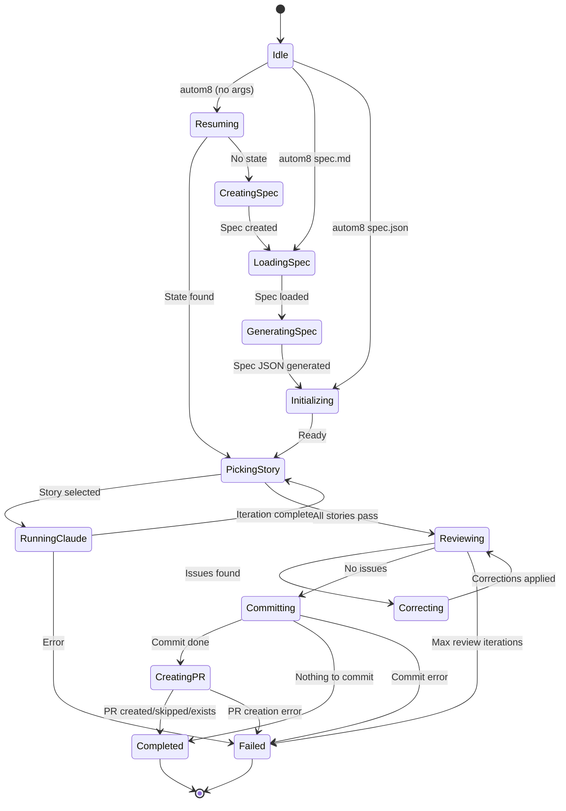

# autom8


**Ship features while you sleep.**

autom8 is the missing orchestration layer for AI-powered development. You write a spec describing what you want—autom8 drives Claude through implementation, handles the iteration loop, and delivers working code with a pull request ready for review.

No babysitting. No copy-pasting between chat windows. Just define your feature, kick off the run, and come back to a PR.

## Why autom8?

- **Spec-to-PR in one command** — Write a feature spec, run `autom8`, get a pull request. The entire implementation loop is handled for you.
- **Context that compounds** — Each iteration feeds the git diff from previous work back into the next prompt. Claude always knows what just changed.
- **Interrupt anything, resume anywhere** — State persists automatically. `Ctrl+C` mid-run, grab coffee, `autom8 resume` when you're back.
- **Deterministic orchestration** — LLMs handle the creative work; autom8 handles state, git, reviews, and PR creation with predictable logic.
- **Built-in quality gates** — Automatic review loops catch issues before commit. Claude reviews its own work and fixes problems without your intervention.

## Installation

```bash
cargo install --force --path .
```

**Prerequisites:** The [Claude CLI](https://docs.anthropic.com/en/docs/claude-code) must be installed and authenticated.

**Optional:** Install the [GitHub CLI](https://cli.github.com/) (`gh auth login`) for automatic PR creation.

## Quick Start

### 1. Create and implement your feature

```bash
autom8
```

This single command handles the entire workflow:

1. Spawns an interactive Claude session
2. You describe your feature and answer Claude's questions
3. Claude creates a spec file (saved to `~/.config/autom8/<project>/spec/`)
4. When you exit the session, autom8 detects the new spec
5. Automatically proceeds to implementation

**Alternative:** If you already have a spec file, pass it directly:

```bash
autom8 spec.md      # Markdown spec
autom8 spec.json    # JSON spec
```

Or run `autom8` without arguments to select from existing specs interactively.

### 2. Watch it work


autom8 converts specs to JSON, picks the highest-priority incomplete story, runs Claude to implement it, reviews the work, fixes issues automatically, and commits when all stories pass.

## Under the Hood

autom8 isn't just a wrapper around `claude`—it's an orchestration engine with some clever mechanics.

### Context That Compounds

Each Claude iteration doesn't start from scratch. Before every prompt, autom8 injects the **git diff from the previous iteration** directly into the context. This means Claude always knows exactly what just changed, can build on its own work intelligently, and catches its own mistakes in subsequent passes.

The result: multi-story features maintain coherence across hours of autonomous work, and each iteration is informed by real code changes rather than just conversation history.

### Interrupt Anything, Resume Anywhere

The entire run state—current story, iteration count, review status—persists to `.autom8/state.json` after every transition. Hit `Ctrl+C` mid-implementation, and `autom8 resume` picks up exactly where you left off.

This isn't just "save progress." autom8 snapshots the full context including which stories passed, what branch you're on, and your original config settings. Leave a run overnight; resume it tomorrow with full fidelity.

### Self-Healing Review Loops

When all stories pass, autom8 doesn't just commit. It runs a dedicated review phase where Claude examines the complete implementation for edge cases, code quality, and missed requirements. If issues are found, autom8 automatically enters a correction cycle—Claude fixes the problems and review runs again.

Up to three review/correct iterations happen automatically before requiring intervention. Most runs self-correct without you ever knowing there was an issue.

### Deterministic Orchestration

LLMs are powerful but unpredictable. autom8 keeps them focused on what they're good at—understanding requirements, writing code, reviewing changes—while handling everything else with boring, reliable logic:

- **State machine**: Explicit states and transitions, no ambiguous "maybe it's done?" moments
- **Git operations**: Predictable branch management, commit filtering, PR creation
- **Completion detection**: Claude signals completion through structured output, not vibes
- **Iteration limits**: Hard caps prevent runaway loops

The philosophy: let Claude be creative; let autom8 be predictable.

## State Machine

Under the hood, autom8 runs a deterministic state machine—no guessing whether things are "probably done." Every transition is explicit, every state is persisted, and you can interrupt at any point knowing exactly where you'll resume.



The states you'll see most often: **running-claude** (implementation in progress), **reviewing** (quality check), **correcting** (fixing issues), and **completed** (ready for your review). Everything else is orchestration plumbing.

## CLI Commands

```bash
autom8                    # Resume existing state or start spec creation (recommended)
autom8 <file>             # Run with specific spec.md or spec.json
autom8 run --spec <file>  # Explicit run command
autom8 run --skip-review  # Skip the review loop
autom8 status             # Check current run status
autom8 resume             # Resume a failed/interrupted run
autom8 projects           # List all known projects
autom8 clean              # Delete spec.md and spec.json from CWD
autom8 init               # Pre-create config directory structure (optional)
```

## Spec Format

Specs can be written in Markdown (`spec.md`) or JSON (`spec.json`). autom8 converts Markdown to JSON internally. Here's the JSON structure:

```json
{
  "project": "my-project",
  "branchName": "feature/my-feature",
  "description": "What this feature does and why",
  "userStories": [
    {
      "id": "US-001",
      "title": "First Story",
      "description": "What this story accomplishes",
      "acceptanceCriteria": ["First criterion", "Second criterion"],
      "priority": 1,
      "passes": false,
      "notes": "Optional implementation hints"
    }
  ]
}
```

## Automatic PR Creation

After committing, autom8 creates a pull request via GitHub CLI (`gh`). Requirements:

- `gh` CLI installed and authenticated (`gh auth login`)
- On a feature branch (not `main`/`master`)

PR creation is gracefully skipped if requirements aren't met or a PR already exists—autom8 still completes successfully.

<!-- TODO: Add result.png screenshot showing PR creation output -->

## File Storage

- **Specs:** `~/.config/autom8/<project>/spec/`
- **Run state:** `.autom8/state.json` in your project directory

In git repositories, autom8 automatically creates or checks out the branch specified in `branchName`.

## Screenshots

|  |  |  |
|:-----------------------------:|:------------------------------------:|:------------------------------------:|
| Default command               | Shell completion                     | Describe command                     |

## License

MIT
