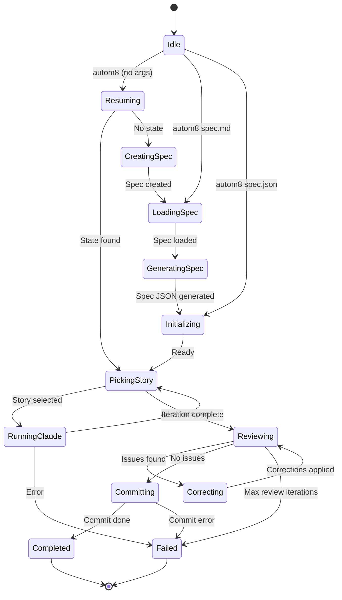

# autom8

A CLI automation tool for orchestrating Claude-powered development. Define your feature requirements in a spec, and let autom8 drive Claude through iterative implementation of each user story.

## Overview

autom8 bridges the gap between product requirements and working code. You describe what you want to build, and autom8 orchestrates Claude to implement it story by story, tracking progress and managing state throughout.

### Key Features

- **Spec-driven development** - Define features as structured user stories with acceptance criteria
- **Iterative implementation** - Claude implements one story at a time, marking progress as it goes
- **State persistence** - Interrupt and resume runs at any time
- **Git integration** - Automatic branch management for feature development
- **Progress tracking** - Visual feedback on implementation progress

## Installation

```bash
cargo install --path .
```

Requires the `claude` CLI to be installed and configured.

## Quick Start

### 1. Create and implement your feature

```bash
autom8
```

This single command handles the entire workflow:

1. Spawns an interactive Claude session
2. You describe your feature and answer Claude's questions
3. Claude creates a spec file (saved to `~/.config/autom8/<project>/spec/`)
4. When you exit the session, autom8 detects the new spec
5. Automatically proceeds to implementation

Example session:

```
$ autom8

Starting new spec creation session...

[Claude session starts - you interact naturally]
...
[You exit the Claude session]

Detected new spec file: ~/.config/autom8/my-project/spec/spec-my-feature.md
Proceeding to implementation...

[autom8 implementation begins]
```

### Alternative: Direct file usage

If you already have a spec file, run autom8 with the file path:

```bash
autom8 spec.md
```

You can also run `autom8` without arguments to interactively select from existing spec files.

### 2. Watch it work

autom8 will:
1. Convert your `spec.md` to structured `spec.json`
2. Pick the highest-priority incomplete story
3. Run Claude to implement it
4. Review the implementation and fix any issues
5. Commit when all stories pass

## Workflow

```
┌──────────────────────────────────────────────────────────────┐
│ 1. Create and implement                                      │
│    $ autom8                                                  │
│                                                              │
│    - Opens interactive Claude session                        │
│    - You describe feature and answer questions               │
│    - Claude creates spec.md → ~/.config/autom8/<project>/spec│
│    - On exit: detects spec and starts implementation         │
│    - Converts spec.md → spec.json                            │
│    - Iterates through user stories                           │
│    - Reviews implementation, fixes issues                    │
│    - Commits all changes when feature is complete            │
└──────────────────────────────────────────────────────────────┘
                              │
                              ▼
┌──────────────────────────────────────────────────────────────┐
│ 2. Feature complete!                                         │
│    All user stories implemented and passing                  │
└──────────────────────────────────────────────────────────────┘
```

## State Machine

autom8 uses a state machine to track progress through the implementation process:



### State Descriptions

| State | Description |
|-------|-------------|
| `idle` | Initial state, no active run |
| `resuming` | Checking for existing state to resume |
| `creating-spec` | Interactive Claude session for spec creation |
| `loading-spec` | Loading and validating spec.md file |
| `generating-spec` | Claude converting spec.md → spec.json |
| `initializing` | Loading spec, setting up git branch |
| `picking-story` | Selecting next incomplete user story |
| `running-claude` | Claude implementing current story |
| `reviewing` | Claude reviewing completed implementation |
| `correcting` | Claude fixing issues found during review |
| `committing` | Claude committing changes for completed feature |
| `completed` | All user stories pass |
| `failed` | Error occurred, run stopped |

## CLI Commands

```bash
autom8                    # Resume existing state or start spec creation (recommended)
autom8 <file>             # Run with specific spec.md or spec.json
autom8 run --spec <file>  # Explicit run command
autom8 run --skip-review  # Skip the review loop
autom8 status             # Check current run status
autom8 resume             # Resume a failed/interrupted run
autom8 projects           # List all known projects
autom8 clean              # Delete spec.md and spec.json from CWD
autom8 init               # Pre-create config directory structure (optional)
```

## Spec Format

### Markdown (spec.md)

```markdown
# Feature Name

## Project
my-project

## Branch
feature/my-feature

## Description
A description of what this feature does and why it's needed.

## User Stories

### US-001: First Story
**Priority:** 1

Description of what this story accomplishes.

**Acceptance Criteria:**
- [ ] First criterion
- [ ] Second criterion

**Notes:** Implementation hints

### US-002: Second Story
**Priority:** 2
...
```

### JSON (spec.json)

```json
{
  "project": "my-project",
  "branchName": "feature/my-feature",
  "description": "A description of what this feature does...",
  "userStories": [
    {
      "id": "US-001",
      "title": "First Story",
      "description": "Description of what this story accomplishes",
      "acceptanceCriteria": ["First criterion", "Second criterion"],
      "priority": 1,
      "passes": false,
      "notes": "Implementation hints"
    }
  ]
}
```

## How It Works

1. **Story Selection**: autom8 picks the highest-priority story where `passes: false`

2. **Claude Execution**: Spawns Claude with a prompt containing:
   - Project context
   - Story details and acceptance criteria
   - Instructions to implement, test, and mark complete

3. **Completion Detection**: Claude updates `spec.json` setting `passes: true` when a story's acceptance criteria are met

4. **Iteration**: Process repeats until all stories pass or max iterations reached

5. **Review Loop**: When all stories pass, Claude reviews the implementation:
   - Checks for issues, edge cases, and code quality
   - If issues are found, enters correction mode to fix them
   - Review/correct cycles up to 3 times before failing

6. **Committing**: When review passes, Claude commits changes (only files it modified, excluding spec.json and .autom8/)

## State Persistence

Run state is saved to `.autom8/state.json`, allowing you to:
- Interrupt with Ctrl+C and resume later
- Check progress with `autom8 status`

Completed runs are archived to `.autom8/runs/`.

## File Storage

Spec files are stored in `~/.config/autom8/<project>/spec/`:

```
~/.config/autom8/
└── my-project/
    ├── spec/          # Spec files (spec-feature.md, spec-feature.json)
    └── runs/          # Archived run state
```

The `init` command pre-creates this directory structure, but it's optional — directories are created automatically when needed.

## Configuration

### Git Integration

If running in a git repository, autom8 will:
- Check out or create the branch specified in `branchName`
- Allow Claude to commit changes as it implements
- The easier (and recommended) thing is to just switch to your desired
  branch before starting any work.

## Example Session

```
$ autom8 spec.md

+---------------------------------------------------------+
|  autom8 v0.1.0                                          |
+---------------------------------------------------------+

[state] idle -> loading-spec
Spec: ./spec.md (1.2 KB)

[state] loading-spec -> generating-spec
Converting to spec.json...
Claude is working...

Spec Generated Successfully
Project: my-api
Stories: 3
  - US-001: Set up project structure
  - US-002: Implement user endpoint
  - US-003: Add authentication

Saved: .autom8/spec/spec-my-api.json

[state] generating-spec -> initializing
Proceeding to implementation...

[state] initializing -> picking-story
Project: my-api
Branch:  feature/my-api
Stories: [░░░░░░░░░░░░] 0/3 complete

[state] picking-story -> running-claude
Iteration 1/10 - Running US-001: Set up project structure
Claude is working...

[state] running-claude -> picking-story
Story US-001 complete!

... (more iterations) ...

[state] picking-story -> reviewing
All stories complete! Running review...
Review 1/3 - Checking implementation...

[state] reviewing -> committing
Review passed! Committing changes...

[state] committing -> completed
Feature complete!
```

## License

MIT
