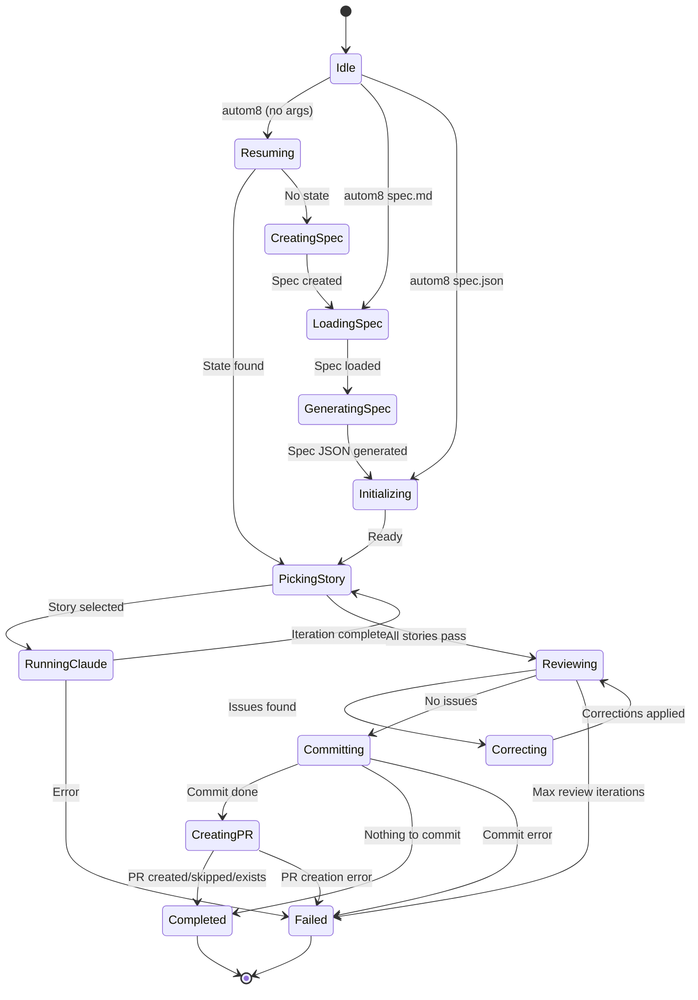

# autom8


A CLI tool for orchestrating Claude-powered development. Define your feature requirements as a spec, and autom8 drives Claude through iterative implementation—managing state, context, and quality gates—until you have working code and a pull request ready for review.

## Why autom8?

- **Spec-to-PR workflow** — Write a feature spec, run `autom8`, receive a pull request. The implementation loop runs autonomously.
- **Cumulative context** — Each iteration receives the git diff from previous work. Claude operates with awareness of what changed, enabling coherent multi-story implementations.
- **Persistent state** — Full run state saves after every transition. Interrupt at any point and resume with `autom8 resume`.
- **Deterministic orchestration** — LLMs handle implementation; autom8 handles state transitions, git operations, reviews, and PR creation with predictable logic.
- **Automated review** — Built-in review loops identify issues before commit. Claude examines its own work and applies corrections without manual intervention.

## Installation

```bash
# From crates.io
cargo install autom8

# From source
cargo install --force --path .
```

**Prerequisites:**
- **Rust 1.80+**: Install via [rustup](https://rustup.rs/)
- **[Claude CLI](https://docs.anthropic.com/en/docs/claude-code)**: Must be installed and authenticated

**Optional:** Install the [GitHub CLI](https://cli.github.com/) (`gh auth login`) for automatic PR creation.

## Quick Start

### 1. Create and implement your feature

```bash
autom8
```

This single command handles the entire workflow:

1. Spawns an interactive Claude session
2. You describe your feature and answer Claude's questions
3. Claude creates a spec file (saved to `~/.config/autom8/<project>/spec/`)
4. When you exit the session, autom8 detects the new spec
5. Automatically proceeds to implementation

**Alternative:** If you already have a spec file, pass it directly:

```bash
autom8 spec.md      # Markdown spec
autom8 spec.json    # JSON spec
```

### 2. Watch it work


autom8 converts specs to JSON, picks the highest-priority incomplete story, runs Claude to implement it, reviews the work, fixes issues automatically, and commits when all stories pass.

## How It Works

### Cumulative Context

Each Claude iteration receives the **git diff from the previous iteration** in its prompt. This provides Claude with precise awareness of recent changes, enabling coherent multi-story implementations and self-correction across iterations.

### State Persistence

Run state—current story, iteration count, review status—persists to `.autom8/state.json` after every transition. This includes story completion status, branch information, and original config settings. Runs can be interrupted and resumed with full fidelity.

### Review Loops

After all stories pass, autom8 runs a review phase where Claude examines the complete implementation for edge cases, code quality, and missed requirements. If issues are found, autom8 enters a correction cycle—Claude applies fixes and review runs again. Up to three review/correct iterations occur automatically before requiring intervention.

### Orchestration Design

autom8 constrains LLM usage to implementation tasks while handling orchestration deterministically:

- **State machine**: Explicit states and transitions with well-defined completion criteria
- **Git operations**: Predictable branch management, commit filtering, PR creation
- **Completion detection**: Claude signals completion through structured output tags
- **Iteration limits**: Hard caps prevent unbounded loops

## State Machine

autom8 uses a deterministic state machine for orchestration. Every transition is explicit, every state is persisted, and interruption at any point preserves the exact position for resumption.



Primary states: **running-claude** (implementation in progress), **reviewing** (quality check), **correcting** (applying fixes), and **completed** (ready for review).

## CLI Commands

```bash
autom8                    # Resume existing state or start spec creation (recommended)
autom8 <file>             # Run with specific spec.md or spec.json
autom8 run --spec <file>  # Explicit run command
autom8 run --skip-review  # Skip the review loop
autom8 status             # Check current run status
autom8 resume             # Resume a failed/interrupted run
autom8 projects           # List all known projects
autom8 clean              # Delete spec.md and spec.json from CWD
autom8 init               # Pre-create config directory structure (optional)
```

## Spec Format

Specs can be written in Markdown (`spec.md`) or JSON (`spec.json`). autom8 converts Markdown to JSON internally. Here's the JSON structure:

```json
{
  "project": "my-project",
  "branchName": "feature/my-feature",
  "description": "What this feature does and why",
  "userStories": [
    {
      "id": "US-001",
      "title": "First Story",
      "description": "What this story accomplishes",
      "acceptanceCriteria": ["First criterion", "Second criterion"],
      "priority": 1,
      "passes": false,
      "notes": "Optional implementation hints"
    }
  ]
}
```

## Configuration

autom8 uses TOML configuration files to control behavior.

**Global config:** `~/.config/autom8/config.toml`

```toml
# Enable/disable the review phase before committing
review = true

# Enable/disable automatic commits
commit = true

# Enable/disable automatic PR creation (requires commit = true)
pull_request = true

# Create PRs as drafts instead of ready for review (only applies when pull_request = true)
pull_request_draft = false
```

**Per-project config:** `~/.config/autom8/<project>/config.toml`

Project-specific configuration overrides global settings. When a project config doesn't exist, it inherits from the global config.

## Automatic PR Creation

After committing, autom8 creates a pull request via GitHub CLI (`gh`). Requirements:

- `gh` CLI installed and authenticated (`gh auth login`)
- On a feature branch (not `main`/`master`)

PR creation is gracefully skipped if requirements aren't met or a PR already exists—autom8 still completes successfully.

**PR Templates:** If your repository contains a pull request template (`.github/pull_request_template.md`, `.github/PULL_REQUEST_TEMPLATE.md`, or `pull_request_template.md`), autom8 detects it and populates the template with implementation details from the spec.

## File Storage

- **Specs:** `~/.config/autom8/<project>/spec/`
- **Run state:** `.autom8/state.json` in your project directory

In git repositories, autom8 automatically creates or checks out the branch specified in `branchName`.

## Screenshots

|  |  |  |
|:-----------------------------:|:------------------------------------:|:------------------------------------:|
| Default command               | Shell completion                     | Describe command                     |

|  |  |
|:---------------------------------------:|:----------------------------------------------:|
| Review and commit process               | Run history with iteration details             |

## License

MIT
