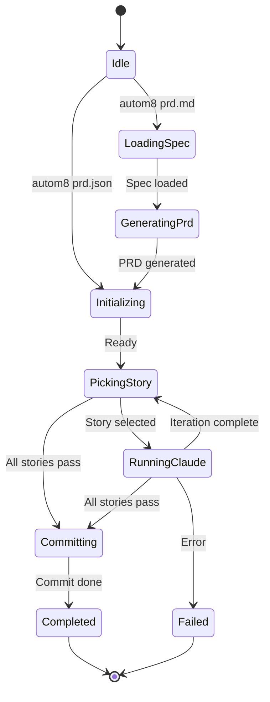

# autom8

A CLI automation tool for orchestrating Claude-powered development. Define your feature requirements in a PRD, and let autom8 drive Claude through iterative implementation of each user story.

## Overview

autom8 bridges the gap between product requirements and working code. You describe what you want to build, and autom8 orchestrates Claude to implement it story by story, tracking progress and managing state throughout.

### Key Features

- **PRD-driven development** - Define features as structured user stories with acceptance criteria
- **Iterative implementation** - Claude implements one story at a time, marking progress as it goes
- **State persistence** - Interrupt and resume runs at any time
- **Git integration** - Automatic branch management for feature development
- **Progress tracking** - Visual feedback on implementation progress

## Installation

```bash
cargo install --path .
```

Requires the `claude` CLI to be installed and configured.

## Quick Start

### 1. Create your PRD

Run `autom8 skill prd` to get the PRD creation prompt, then use it in a Claude session:

```bash
# Get the PRD creation prompt
autom8 skill prd

# Paste it into Claude and describe your feature
# Save Claude's output as prd.md
```

### 2. Run autom8

```bash
# Just run autom8 - it auto-detects prd.md or prd.json
autom8

# Or specify a file directly
autom8 prd.md      # Converts to JSON and implements
autom8 prd.json    # Implements directly
```

### 3. Watch it work

autom8 will:
1. Convert your `prd.md` to structured `prd.json`
2. Pick the highest-priority incomplete story
3. Run Claude to implement it
4. Repeat until all stories pass

## Workflow

```
┌─────────────────────────────────────────────────────────────┐
│ 1. Create prd.md interactively with Claude                  │
│    $ autom8 skill prd  →  paste into Claude  →  save output │
└─────────────────────────────────────────────────────────────┘
                              │
                              ▼
┌─────────────────────────────────────────────────────────────┐
│ 2. Run autom8                                               │
│    $ autom8                                                 │
│                                                             │
│    - Detects prd.md → converts to prd.json                  │
│    - Iterates through user stories                          │
│    - Claude implements each story                           │
│    - Marks stories complete when tests pass                 │
│    - Commits all changes when feature is complete           │
└─────────────────────────────────────────────────────────────┘
                              │
                              ▼
┌─────────────────────────────────────────────────────────────┐
│ 3. Feature complete!                                        │
│    All user stories implemented and passing                 │
└─────────────────────────────────────────────────────────────┘
```

## State Machine

autom8 uses a state machine to track progress through the implementation process:



### State Descriptions

| State | Description |
|-------|-------------|
| `idle` | Initial state, no active run |
| `loading-spec` | Loading and validating prd.md file |
| `generating-prd` | Claude converting prd.md → prd.json |
| `initializing` | Loading PRD, setting up git branch |
| `picking-story` | Selecting next incomplete user story |
| `running-claude` | Claude implementing current story |
| `committing` | Claude committing changes for completed feature |
| `completed` | All user stories pass |
| `failed` | Error occurred, run stopped |

## CLI Commands

```bash
autom8                    # Auto-detect and run (interactive)
autom8 <file>             # Run with specific prd.md or prd.json
autom8 run --prd <file>   # Explicit run command
autom8 status             # Check current run status
autom8 resume             # Resume a failed/interrupted run
autom8 history            # List past runs
autom8 archive            # Archive current run and reset
autom8 clean              # Delete prd.md and prd.json
autom8 skill prd          # Output PRD creation prompt
autom8 skill prd-json     # Output PRD→JSON conversion prompt
```

## PRD Format

### Markdown (prd.md)

```markdown
# Feature Name

## Project
my-project

## Branch
feature/my-feature

## Description
A description of what this feature does and why it's needed.

## User Stories

### US-001: First Story
**Priority:** 1

Description of what this story accomplishes.

**Acceptance Criteria:**
- [ ] First criterion
- [ ] Second criterion

**Notes:** Implementation hints

### US-002: Second Story
**Priority:** 2
...
```

### JSON (prd.json)

```json
{
  "project": "my-project",
  "branchName": "feature/my-feature",
  "description": "A description of what this feature does...",
  "userStories": [
    {
      "id": "US-001",
      "title": "First Story",
      "description": "Description of what this story accomplishes",
      "acceptanceCriteria": ["First criterion", "Second criterion"],
      "priority": 1,
      "passes": false,
      "notes": "Implementation hints"
    }
  ]
}
```

## How It Works

1. **Story Selection**: autom8 picks the highest-priority story where `passes: false`

2. **Claude Execution**: Spawns Claude with a prompt containing:
   - Project context
   - Story details and acceptance criteria
   - Instructions to implement, test, and mark complete

3. **Completion Detection**: Claude updates `prd.json` setting `passes: true` when a story's acceptance criteria are met

4. **Iteration**: Process repeats until all stories pass or max iterations reached

5. **Committing**: When all stories pass, Claude commits changes (only files it modified, excluding prd.json and .autom8/)

## State Persistence

Run state is saved to `.autom8/state.json`, allowing you to:
- Interrupt with Ctrl+C and resume later
- Check progress with `autom8 status`
- Review history with `autom8 history`

Completed runs are archived to `.autom8/runs/`.

## Configuration

### Max Iterations

Limit the number of Claude invocations (default: 10):

```bash
autom8 run --prd prd.json --max_iterations 20
```

### Git Integration

If running in a git repository, autom8 will:
- Check out or create the branch specified in `branchName`
- Allow Claude to commit changes as it implements

## Example Session

```
$ autom8

+---------------------------------------------------------+
|  autom8 v0.1.0                                          |
+---------------------------------------------------------+

[detecting] Scanning for PRD files...

Found prd.md at ./prd.md

? Found prd.md spec file. What would you like to do?

  > 1. Convert to prd.json and start implementation
    2. Delete and start fresh
    3. Exit

Enter choice [1]: 1

→ Converting prd.md to prd.json and starting implementation

[state] idle -> loading-spec
Spec: ./prd.md (1.2 KB)

[state] loading-spec -> generating-prd
Converting to prd.json...
---------------------------------------------------------
Claude is working...
...

PRD Generated Successfully
Project: my-api
Stories: 3
  - US-001: Set up project structure
  - US-002: Implement user endpoint
  - US-003: Add authentication

Saved: ./prd.json

[state] generating-prd -> initializing
---------------------------------------------------------
Proceeding to implementation...
---------------------------------------------------------

[state] initializing -> picking-story
Project: my-api
Branch:  feature/my-api
Stories: [░░░░░░░░░░░░] 0/3 complete

[state] picking-story -> running-claude
---------------------------------------------------------
Iteration 1/10 - Running US-001: Set up project structure
---------------------------------------------------------

Claude is working...
...
```

## License

MIT
