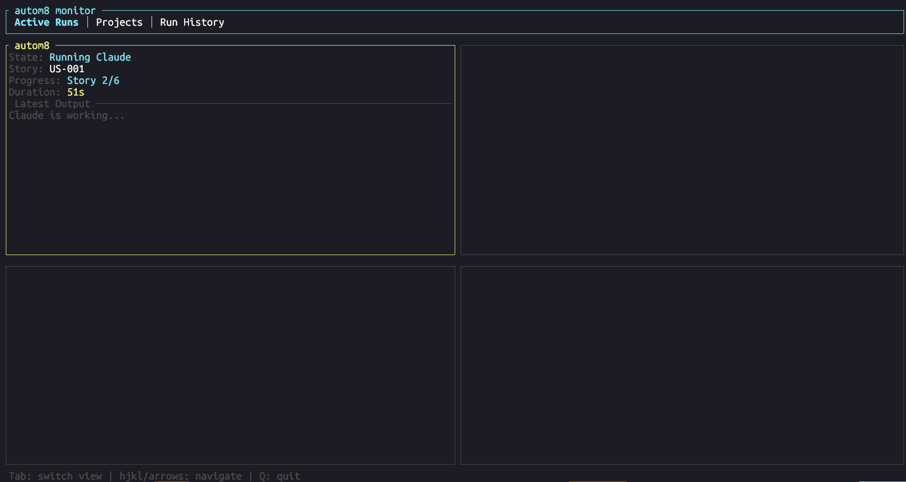
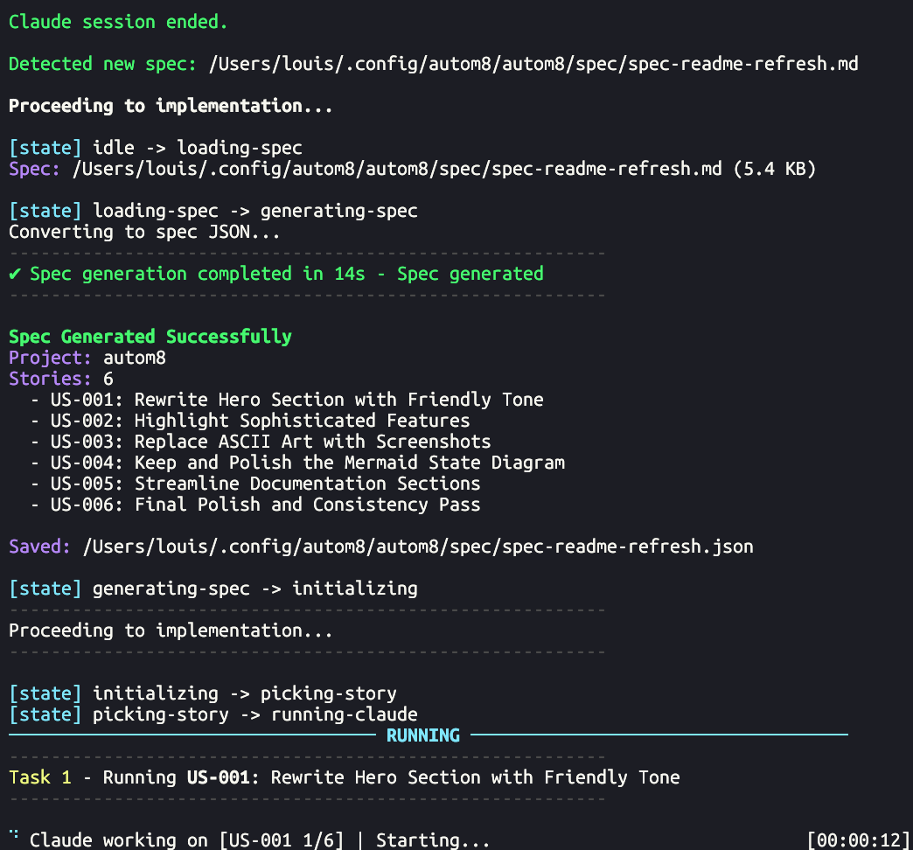
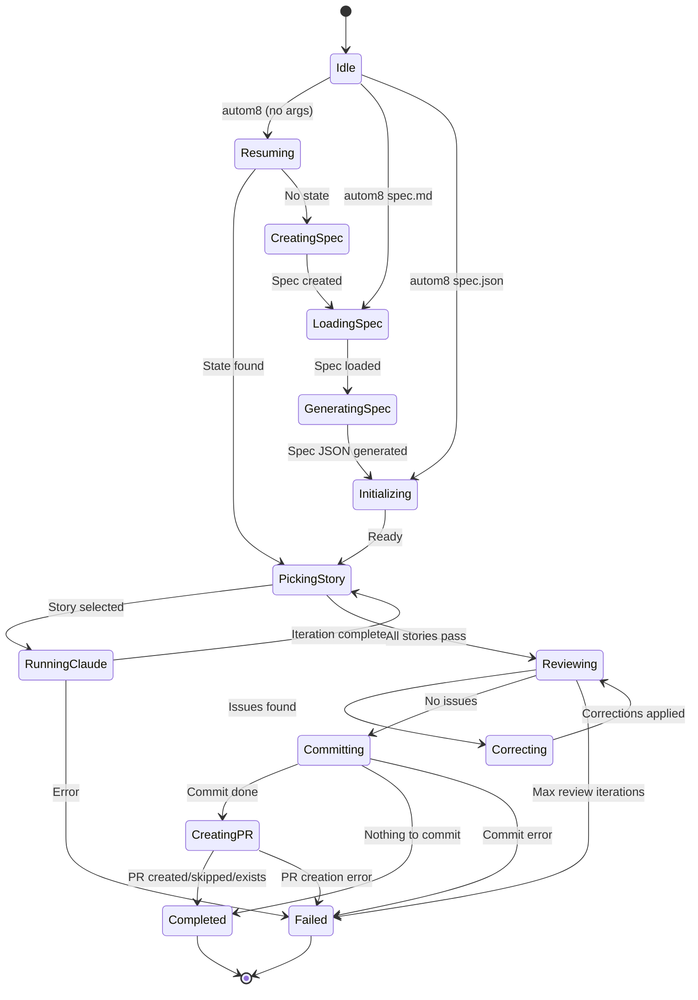
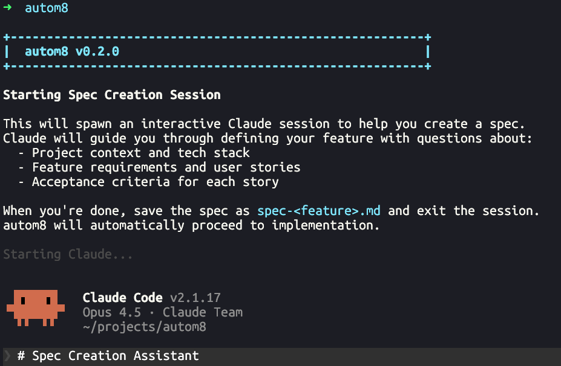
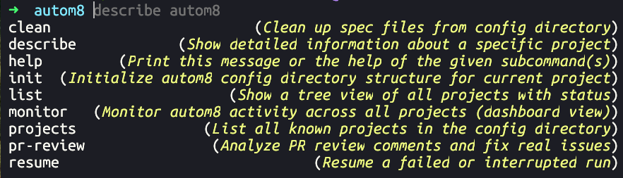
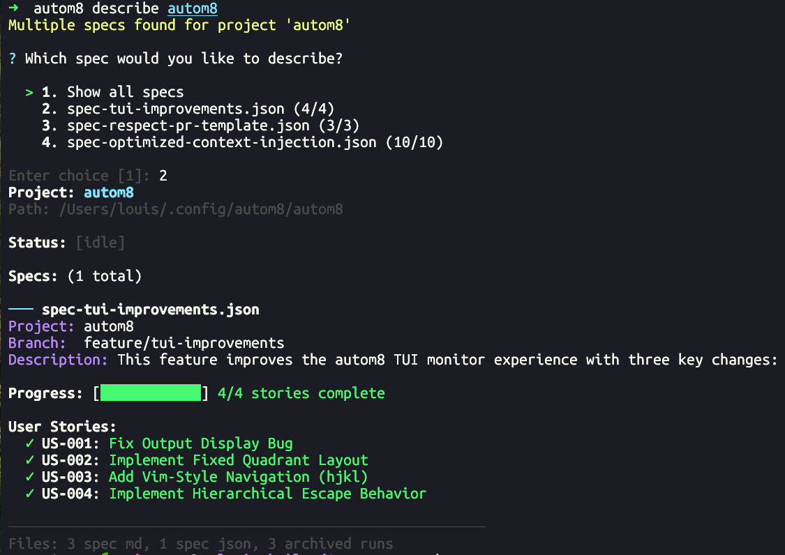
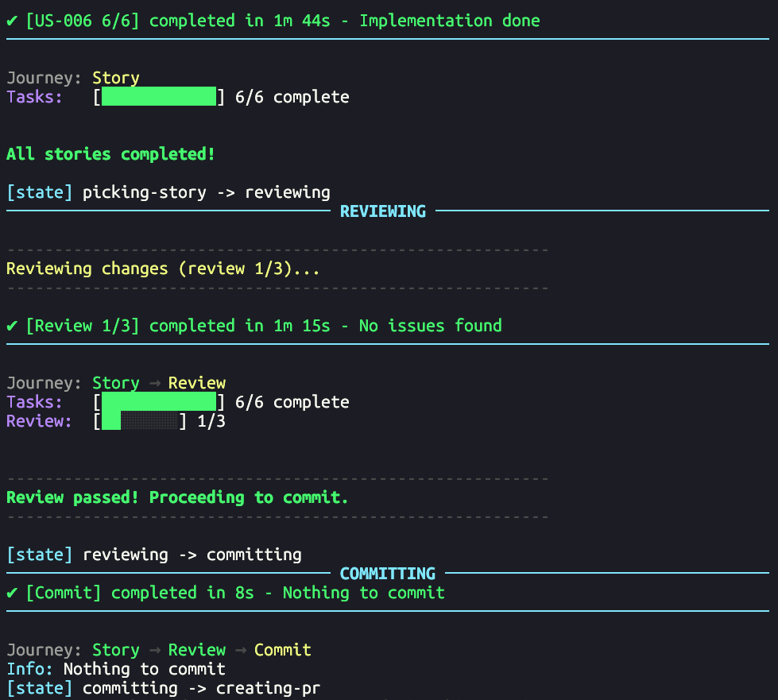
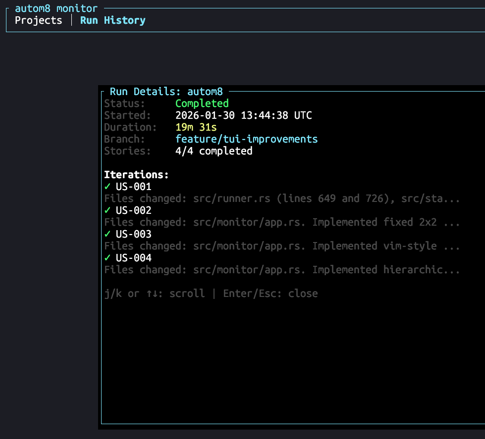

# autom8



A simple, fast, and deterministic-when-possible CLI tool for orchestrating Claude-powered development. No external deps or setup required; one binary to rule them all.

Run `autom8` from your project, describe what you want to build, and Claude helps you write a structured spec. When you're done going back and forth with Claude and have the spec file generated, exit the Claude session (`/exit` or `ctrl-d`) and autom8 takes over: it drives Claude through implementation story by story, reviews the work, and optionally commit/open a PR when everything passes.

**Spec to PR in one command.** Run `autom8`, describe your feature to Claude and
let Claude help you define a spec you're happy with.
Claude run's as a subprocess, when you're satisfied with the spec, exit the
claude session and autom8 will pick this up: it finds the newly created spec file based on
your current project and starts the pipeline. Monitor it via a TUI with `autom8 monitor` or
with the rich native GUI `autom8 gui`.

**Context and Knowledge accumulation.** As autom8 works through your stories, it builds a knowledge graph of what's been done: which files were touched and why, architectural decisions that were made, patterns to follow, and a summary of each story's changes. Claude sees this context on every iteration, so later agents build coherently on earlier ones.

**Interruptible and resumable.** State persists after every transition. Close your laptop mid-run, come back later, and `autom8 resume` picks up exactly where it left off.

**Review before commit.** After implementation, autom8 runs a review phase where Claude examines the complete work for edge cases and missed requirements. If issues are found, it enters a correction cycle automatically. You get cleaner PRs without manual back-and-forth.

**Deterministic orchestration.** The LLM handles implementation; autom8 handles everything else with predictable logic: state transitions, git operations, branch management, and PR creation.

## Installation

```bash
# From crates.io
cargo install autom8

# From source
cargo install --force --path .
```

You'll need Rust 1.88+ (install via [rustup](https://rustup.rs/)) and the [Claude CLI](https://docs.anthropic.com/en/docs/claude-code) installed and authenticated. For automatic PR creation, install the [GitHub CLI](https://cli.github.com/) and run `gh auth login`.

## Quick Start

### 1. Create and implement your feature

```bash
autom8
```

Build a spec with Claude's help by running `autom8`. Describe your feature, answer Claude's questions, and it'll create a structured spec for you. When you're happy with the spec, exit the session (`/exit` or `Ctrl-d`) and autom8 takes over from there, implementing each story until you have a PR ready for review.

If you already have a spec file, pass it directly:

```bash
autom8 spec.md      # Markdown spec
autom8 spec.json    # JSON spec
```

### 2. Watch it work



autom8 converts specs to JSON, picks the highest-priority incomplete story, runs Claude to implement it, reviews the work, fixes issues automatically, and commits when all stories pass.

## How It Works

### Knowledge Accumulation

autom8 maintains a structured knowledge graph throughout the run. After each story, it captures which files were touched (with their purposes and key symbols), architectural decisions that were made, patterns to follow, and a summary of what each story created, modified, or deleted.

This context is injected into every Claude prompt, so later stories see what earlier ones accomplished. It's more than just a git diff; it's semantic understanding of what's been built.

### State Persistence

Run state (current story, iteration count, review status, the knowledge graph) persists after every transition. Runs can be interrupted and resumed with full fidelity. When you resume, autom8 continues from exactly where it stopped, with all context intact.

### Review Loops

After all stories pass, autom8 runs a review phase where Claude examines the complete implementation for edge cases, code quality, and missed requirements. If issues are found, it enters a correction cycle: Claude applies fixes, review runs again, up to three iterations. This catches problems before the PR is opened.

### Orchestration Design

autom8 keeps the LLM focused on implementation while handling everything else deterministically. The state machine has explicit states with defined completion criteria. Git operations (branch management, commit filtering, PR creation) are predictable. Claude signals completion through structured output tags, and hard iteration limits prevent runaway loops. We do one "agent" per "story" where knowledge graph is passed to each agent via prompt template injection.

## State Machine

The orchestration loop is a deterministic state machine. Every transition is explicit and persisted, so you can interrupt at any point and resume later.



Primary states: **running-claude** (implementation in progress), **reviewing** (quality check), **correcting** (applying fixes), and **completed** (ready for review).

## Monitoring

autom8 comes with both a terminal UI and a native desktop GUI for watching your runs.

**Terminal UI** (`autom8 monitor`): A ratatui-based dashboard showing active sessions, project list, and run history. Keyboard-navigable and works over SSH.

**Desktop GUI** (`autom8 gui`): A native immediate mode application built with egui. Shows live session output, run history with iteration details, and lets you edit configuration. Useful when you want to keep an eye on multiple projects.

Both interfaces update in real-time and work across all your worktrees.

## CLI Commands

```bash
autom8                    # Resume existing state or start spec creation
autom8 <file>             # Run with specific spec.md or spec.json
autom8 run --spec <file>  # Explicit run command
autom8 run --skip-review  # Skip the review loop
autom8 status             # Check current run status
autom8 resume             # Resume a failed/interrupted run
autom8 monitor            # Open the terminal UI dashboard
autom8 gui                # Open the native desktop GUI
autom8 projects           # List all known projects
autom8 clean              # Delete spec.md and spec.json from CWD
autom8 init               # Pre-create config directory structure
```

## Spec Format

Specs are initially in Markdown (`spec.md`) and then converted to JSON internally (`spec.json`).
Here's a sample of the JSON structure:

```json
{
  "project": "my-project",
  "branchName": "feature/my-feature",
  "description": "What this feature does and why",
  "userStories": [
    {
      "id": "US-001",
      "title": "First Story",
      "description": "What this story accomplishes",
      "acceptanceCriteria": ["First criterion", "Second criterion"],
      "priority": 1,
      "passes": false,
      "notes": "Optional implementation hints"
    }
  ]
}
```

## Configuration

Configuration lives in `~/.config/autom8/config.toml` (global) or `~/.config/autom8/<project>/config.toml` (per-project). Project settings override global ones. The easiest way to change configs (both global and project specific) is via the gui: `autom8 gui`.

```toml
review = true             # Run review phase before committing
commit = true             # Automatically commit when stories pass
pull_request = true       # Create PR after commit (requires commit = true)
pull_request_draft = false # Create PRs as drafts
```

## Automatic PR Creation

After committing, autom8 creates a pull request using the GitHub CLI. You need `gh` installed and authenticated, and you need to be on a feature branch (not `main` or `master`). If requirements aren't met or a PR already exists, autom8 skips this step gracefully and completes successfully.

If your repository has a PR template (`.github/pull_request_template.md` or similar), autom8 detects it and fills in the template with implementation details from the spec.

## File Storage

Everything lives under `~/.config/autom8/<project>/`: specs in `spec/`, session state in `sessions/<session-id>/state.json`, and archived runs in `runs/`. In git repositories, autom8 automatically creates or checks out the branch specified in `branchName`.

## Screenshots

|  |  |  |
|:-----------------------------:|:------------------------------------:|:------------------------------------:|
| Default command               | Shell completion                     | Describe command                     |

|  |  |
|:---------------------------------------:|:----------------------------------------------:|
| Review and commit process               | Run history with iteration details             |

## License

MIT
